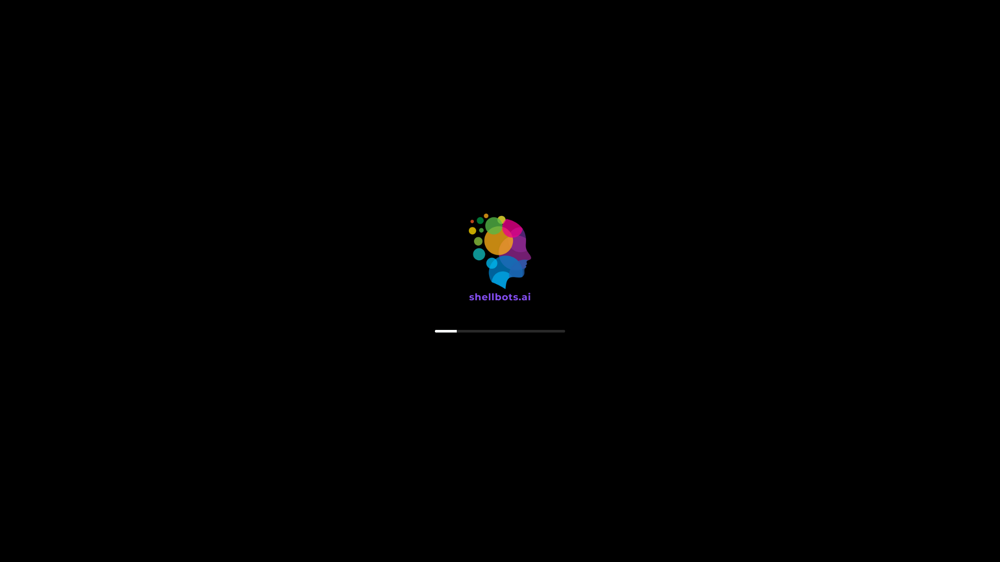

This is a Shellbots boot theme, inspired by iFruit

Installation
-------------------------------------------------------------------

Assuming the unzipped shellbots theme folder is located in your download directory.
Copy the finished theme to /usr/share/plymouth/themes:

`sudo cp -r ~/Downloads/shellbots-colour-main/shellbots /usr/share/plymouth/themes`

After copying, get a list of the installed themes with the following command:

`plymouth-set-default-theme --list`

Set it to shellbots theme:

`sudo plymouth-set-default-theme shellbots -R`
